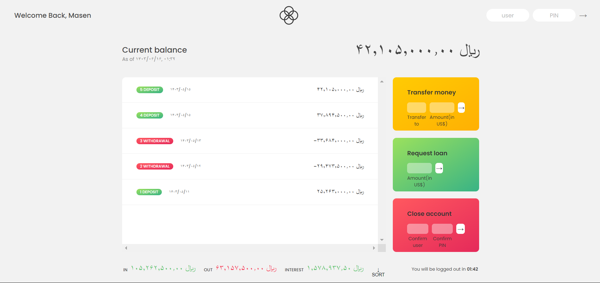

<h1 align="center"> Bankist App 🏦 </h1>

### An application to manage bank accounts and do bank operations written with HTML, CSS and Javascript.
### Main project by "Jonas Schmedtmann" from "Udemy".
### Run the program with live-server on `index.html`
### See demo on [This URL](https://devmasen.github.io/bankist-app/)
#### Use this information to login to default accounts : 
> Username : `js`  Pin : `1111`  
> Username : `jd`  Pin : `2222`   
> Username : `swt`  Pin : `3333`   
> Username : `ss`  Pin : `4444`   
> Username : `mm`  Pin : `5555`
